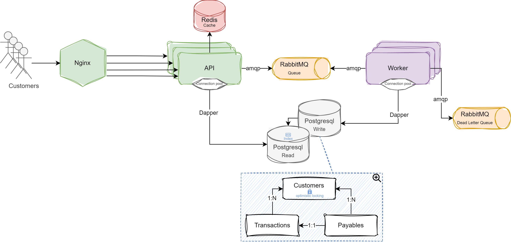

# Payment-Service-Provider

## Sobre o que é esse projeto?
Esse projeto é uma versão muito simplificada de um Payment Service Provider (PSP) e é a minha solução para o [Desafio Software Engineer, Back-end - Pagar.me](https://github.com/pagarme/vagas/tree/master/desafios/software-engineer-backend).

## Disclaimer
As decisões tomadas na construção desse sistema foram feitas pesando no suporte a um alto volume de carga e na adição futura de novas funcionalidades.

## System Design
<p align="center">
   
</p>

## Como usar?
Após clonar o projeto para sua máquina você pode utilizar os seguintes comandos:
```bash
# Rodar aplicação
$ docker-compose up --build --scale api=2 --scale worker=2

# Parar aplicação
$ docker-compose down
```

## Endpoints
[Postman collection](https://github.com/isaac-allef/Payment-Service-Provider/blob/main/assets/psp.postman_collection.json "download")

---
Made by Isaac Allef :wave:
